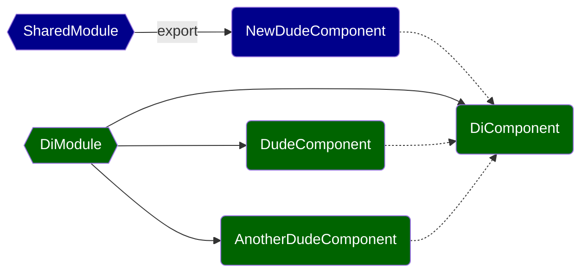

```mermaid
flowchart LR

classDef c1 color: white, fill: darkblue
classDef c2 color: white, fill: darkgreen

Shared{{SharedModule}}:::c1 --> |export| NewDude(NewDudeComponent):::c1
Di{{DiModule}}:::c2 --> DiComponent(DiComponent):::c2
NewDude -.-> DiComponent
Di --> Dude(DudeComponent):::c2
Di --> AnotherDude(AnotherDudeComponent):::c2
Dude-.-> DiComponent
AnotherDude -.-> DiComponent
```